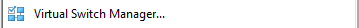

## HOW TO: Create a virtual machine lab

This is a walkthrough for setting up a Vitual Machine (VM) Lab, I seem to be rebuilding them all the time, I thought I would jot down some notes that maybe useful to someone.

This particular setup is for malware static/dynamic anaylsis, however the main points in this process can be used for any type of lab. This walkthrough is targeted at Windows platform. I’m hoping to follow up with some walkthrough notes for QEMU on Linux and UTM on Apple Silcon.

### PREREQUISITE
Hardware
8GB Minimum
Quad Core CPU
Software
Windows 10/11 Operating System
HyperV
VirtualBox (Latest Version)
REMnux (Used in SANS FOR610)
Windows OS ISO
7-Zip

### INSTALL HYPERV
This tutorial assumes you are working with Windows 10/11 Operating system, the first steps would be to enable the HyperV options, this can be easily achieve by using the following guide:

https://learn.microsoft.com/en-us/virtualization/hyper-v-on-windows/quick-start/enable-hyper-v

Once you have enabled HyperV you will have extra application available in your windows administrative tools folder.

### INSTALL VIRTUALBOX
The next step is to install VirtualBox, you might be thinking why install a second Hypervisor (VirtualBox is a Type-2 Hypervisor), I have two reasons I personally install it, has a backup I have found issues with installing certain OS on HyperV, I will then normally try them on VirtualBox and also there is a very useful tool called vboxmanage.exe which comes with it, we will be using this to convert the REMnux distribution from a VMware image to a HyperV image, more on this later.

### INSTALLING REMNUX
You can find the latest version of REMnux from:

https://docs.remnux.org/install-distro/get-virtual-appliance

Once you have downloaded the latest version you should have an OVA file, this can be imported directly into VirtualBox, however as we want to run this on HyperV we need to extract the Virtual Hard Disk and convert it:

I choose to use the General OVA from the link above once downloaded:

After downloading open the OVA file with 7Zip

There are three files, double click on remnux-v7-focal-disk1.vmdk.gz

Then press extract, copy the vdmk file to directory of your choosing

Once downloaded run the vboxmanage.exe command which should be installed when you installed the VirtualBox (found this command orignally from https://chanmingman.wordpress.com/2018/11/21/convert-virtualbox-vmdk-to-vhd/):

Once the file has been converted, Open Hyper-V manager and go to the right hand side and click New -> Virtual Machine

I like to store my VM in certain directories, you can select where to store them on local disk. (You can always move VM stoage to another location if required) Press Next

I have select Generation1 has I don’t think REMnux is created with dependency on UEFI, (It’s built by it’s creators on Ubuntu) Press Next

This is down to how much memory you have available and how much you want to allocate, I generally do not use the “Use Dynamic Memory for this virtual machine” however this dependant on how you want to use your machine. Press Next

I would recommend setup a Virtual Switch using the Virtual switch manager however to get this machine up and running you can leave it not connected for now this setting can be set later. Press Next

At this point, you can move the vhd file that you created earlier to a directory where you want your storage stored or just point it directly at it, for our purposes click Use an existing virtual hard disk and browse to the vhd that you created earlier and then Press Next

You will see a summary just click finish

A new Virtual machine will display in the manager, if you double click this:

You will get the following screen, click the start button:

It may take a little while but should hopefully see the friendly REMnux prompt

### INSTALLING WINDOWS SANDBOX MACHINE
There are several methods to install the Windows Sandbox machine:

#### Method1: Use HyperV built in Build a Windows machine:

HyperV has built in Wizard that will guide you building a Windows machine.

Open HyperV Manager and click on the Quick Create… link on the right hand side under the Actions Menu

You will be presented with the following Wizard Create Virtual Machine:

I normally select the bottom option of Windows 11 dev environment and then press Create Virtual Machine, if you click on More options you will be presented with Network and the Name, feel free to name this VM whatever you want, in regards to the network option I would suggest normally selecting whatever you default switch is initially, you can amend this later.

This will take some time to download:

Extract:

Once completed you will be allowed to connect or edit settings on the VM, click connect to make sure it’s built hopefully you should see something like the following:

#### Method 2: Download the ISO:

You can find the latest Windows ISO images from:

https://www.microsoft.com/software-download/windows11

This will need a little more setup tbc…

Licensing:

The license for these VMs are set to 90 days, I think you can renew them at least once using the Administrator command line of  

slmgr -rearm

I’ve never had to but there are web post that say you can do this up to 6 times at 180days each time.

Alternatively you can purchase a license for around £9.99 at many web vendors, and not worry about the license. Do remember you may have to perform rollback to previous snapshots, so any licensing issues are undesirable if it inteferes with your analysis routine.

### NETWORKING VM IN HYPERV
HyperV creates a Default Switch that is attached to you physical network card normally, what we want to do here is create a Virtual Switch that is independant of the host and does not have ability to route traffic to the internet for anaylsis purposes, you can build more elaborate setups later when you are more familiar with HyperV, The guide below is only for setting up a virtual network switch for Isolated communication between the Windows Sandbox and the REMnux machine.

Open HyperV Manager and click on Virtual Switch Manager… which should be under the right hand side Actions menu

You will see a list of existing Virtual Switches, on the right hand side you will have a panel where you can create a new virtual switch. Where it ask What type of virtual switch do you want to create? Highlight the Private option and click the Create Virtual Switch Button.

Feel free to fill in the Name box and the Notes box and then press Apply and OK at the bottom of the screen

Now back in HyperV Manager go back to your Remnux Virtual machine under the Virtual Machine list and right click and select settings

On settings for the Virtual Machine screen, select the Network Adapter Under the Hardware section and on the right hand side the Network Adapter settings panel should show, look for the Virtual Switch: setting and press down on the right hand side arrow and select the virtual switch you just created and press OK, repeat this for the Windows Sandbox machine.

